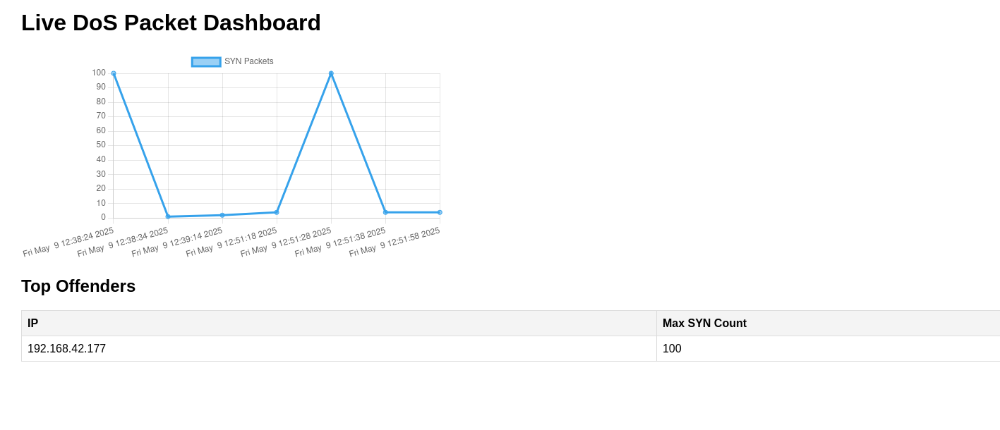

# DoS Detection Dashboard

Welcome to the Live DoS Attack Dashboard! This interactive platform provides real-time insights into Denial of Service (DoS) attacks, making it easy to monitor malicious activity on your network. Using Flask, SocketIO, and Chart.js, the dashboard continuously reads data from a CSV file that tracks the number of SYN packets sent from each IP address.

With a dynamic line chart, you can visualize the frequency of SYN packets, allowing you to identify potential attacks as they happen. The live table displays the latest data, providing an easy-to-read overview of the attack details.



## Features
- **Live Chart:** Displays the number of SYN packets over time.
- **Top Offenders Table:** Shows the IPs that have sent the most SYN packets.
- **Live Update:** The data is updated every 5 seconds.

## Prerequisites
To run this project, you'll need the following Python packages:
- Python 3
- Flask
- Flask-SocketIO
- Eventlet
- Chart.js

### Install Dependencies
First, create and activate a Python virtual environment:
```bash
python3 -m venv venv
source venv/bin/activate  # For Unix/macOS systems
````

Then, install all dependencies using the `requirements.txt` file:

```bash
pip install -r requirements.txt
```

## Running the Project

1. After installing the dependencies, start the Flask server:

   ```bash
   python dashboard.py
   ```
2. Open your browser and navigate to:

   ```
   http://localhost:5000
   ```

The dashboard will display the live SYN packet data and the top offenders table.

### Running with sudo

In case you need to run the script with elevated privileges, especially for network-related tasks, use the following command:

```bash
sudo /path/to/venv/bin/python3 dashboard.py
```

Make sure to replace `/path/to/venv/` with the actual path to your virtual environment. This will ensure that the required environment is used with elevated permissions.


